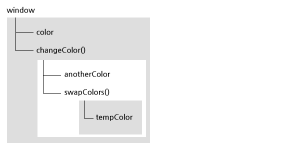

Function 타입
=====

## 실행 컨텍스트와 스코프

* 실행 컨텍스트는 변수나 함수 같은 다른 데이터에 접근할 수 있는지 여부를 규정합니다.
* 실행 컨텍스트는 크게 **전역 컨텍스트**와 **로컬(함수) 컨텍스**트 두 가지 타입이 있습니다.
* 각 실행 컨텍스트에는 변수 객체(Variable Object)가 연결되어 있으며 해당 컨텍스트에서 정의된 모든 변수와 함수는 이 변수 객체에 존재합니다.
* 가장 바깥쪽에 존재하는 실행 컨텍스트는 전역 컨텍스트(window)입니다.
* 함수를 호출하면 독자적인 실행 컨텍스트가 생성되고(로컬 컨텍스트), 코드를 실행 합니다.
* 실행 컨텍스트에서 코드 실행 중 다른 함수를 실행할 때마다 함수의 컨텍스트가 컨텍스트 스택에 쌓입니다. 함수의 실행이 끝나면 해당 컨텍스트를 스택에서 꺼내고 컨트롤을 이전 컨텍스트에 반환합니다.
* 각 컨텍스트에서 코드를 실행하면 변수 객체에 스코프 체인이 만들어 집니다. 스코프 체인은 실행 컨텍스트가 접근할 수 있는 모든 변수와 함수에 순서를 정의하는 것입니다.
* 컨텍스트에서 식별자를 찾을 때는 스코프 체인 순서(부모 컨텍스트의 변수 객체)를 따라가면서 식별자 이름을 검색하고, 찾을 수 없으면 에러가 발생합니다.

```js
var color = 'blue';

function changeColor()  {
    var anotherColor = 'red';
    
    function swapColors() {
        var tempColor = anotherColor;
        
        anotherColor = color;
        color = tempColor;
        
        // color, anotherColor, tempColor 모두 접근가능
    }
    
    // color, anotherColor 접근 가능, tempColor 접근 불가능
    swapColors();
}
// color 만 접근 가능
changeColor();
```

이 코드에는 전역 컨텍스트, `changeColor()` 의 로컬 컨텍스트, `swapColors()` 의 로컬컨텍스트 세 개의 컨텍스트가 있습니다.



내부 컨텍스트는 스코프 체인을 통해 상위 컨텍스트의 변수나 함수에 접근할 수 있지만, 외부에서 내부로 접근할 수는 없습니다.

***** 

## 클로저

클로저란 다른 함수(외부함수)의 스코프에 있는 변수에 접근 가능한 함수를 지칭합니다. 함수를 값으로 사용할 수 있는 프로그래밍 언어의 특성으로, 반환된 내부함수가 다른 컨텍스트에서 실행되는 동안 내부함수의 스코프 체인에 외부함수의 스코프가 포함되어 접근이 가능하게 됩니다.

1. 함수를 실행하면 실행 컨텍스트와 스코프 체인이 생성됩니다. 
2. 전역 컨텍스트의 변수객체는 항상 존재하지만 로컬 컨텍스트(함수)의 변수객체(활성화 객체)는 함수를 실행하는 동안에만 존재합니다.
3. 외부 함수의 변수객체는 내부함수의 스코프 체인의 두번째 객체가 됩니다.
4. 스코프 체인은 전역 컨텍스트까지 이어지고, 함수의 실행이 끝나면 로컬 변수객체(활성화 객체)는 파괴되고 메모리에는 전역 스코프만 남습니다.
5. 클로저는 외부함수가 실행을 마쳤어도 클로저에서 외부함수의 스코프를 참조하고 있으므로 외부함수의 활성화 객체가 파괴되지 않고 메모리에 남아있어, 클로저에서 접근이 가능합니다. 

```js
var scope = 'global';

function outer() {
    var scope = 'outer';
    
    return function() {
        console.log(scope);
    }
}

var inner = outer();            // 클로저 형성

console.log(scope);
console.log(inner);
inner();
```

```js
/*
    myCounter를 객체 리터럴로 초기화하는 대신에
    객체 리터럴을 반환하는 함수를 즉시 호출하여 초기화합니다.
    
    increment와 getValue 메서드를 통해 value라는 변수에 접근할 수 있지만
    함수 유효범위 때문에 프로그램의 나머지 부분에서는 접근할 수가 없습니다.
*/

var myCounter = function() {
    var value = 0;

    return {
        increment: function(inc) {
            value += typeof inc === 'number' ? inc : 1;
        },
        getValue: function() {
            console.log(value);
        }
    };
}();

// increment, getValue 메서드는 계속해서 value라는 변수에 접근할 수 있습니다.
console.log(value);
console.log(myCounter);
myCounter.increment(10);
myCounter.getValue();
myCounter.increment();
myCounter.getValue();
```

*****

## 즉시실행 함수

* 익명함수를 정의하는 동시에 실행, 최초 한 번의 실행이 필요한 초기화 코드들을 지역스코프에서 실행하여 전역변수를 최소화 할 수 있습니다.
* 블록스코프를 흉내낼 수 있습니다.

```js
// 함수표현식을 정의하고 바로 실행할 수 있습니다.
(function() {
    // statements;
})();

+function() {
    // statements;
}();
```

* 함수선언으로 정의된 함수는 바로 실행할 수는 없습니다.
* 자바스크립트는 `function` 키워드를 함수 선언의 시작으로 인식하여, 함수 선언 다음에 바로 실행할 수 없습니다.
* 함수 선언을 `()` 괄호로 감싸거나 연산자 `+, -` 등을 사용해서 함수 표현식으로 바꾸고 바로 실행할 수 있습니다.

```js
function doItImmediately() {
    // statement
}();                // 에러!

function() {
    // statement
}();                // 에러!

(function doItImmediately() {
    // statement
})();

(function() {
    // statement
})();
```

```js
function printNumber(count) {
    for(var i = 0; i < count; i++) {
        document.documentElement.innerHTML += i;
    }

    console.log(i);         // count
}

printNumber(10);

// 블록스코프 흉내내기
function printNumber(count) {
    (function() {
        for(var i = 0; i < count; i++) {
            document.documentElement.innerHTML += i;
        }
    })();

    console.log(i);         // 에러!
}

printNumber(10);
```

*****

## arguments, this 객체

함수를 호출하면 프로그램의 제어를 매개변수와 함께 호출한 함수로 넘깁니다.
모든 함수는 명시되어 있는 매개변수에 더해서 `this`와 `arguments` 라는 추가적인 매개변수를 받게 됩니다.

### arguments 객체

함수를 호출할 때 추가적인 매개변수로 `arguments` 라는 객체를 사용할 수 있습니다. 이 객체는 함수를 호출할 때 전달된 모든 인수에 접근할 수 있게 합니다. 

`arguments` 객체는 `length` 프로퍼티를 가지고 있어 배열과 비슷하지만 실제 배열은 아닙니다. 따라서 모든 배열이 가지고 있는 메서드는 없습니다.

```js
function max() {
    var result = Number.NEGATIVE_INFINITY;
    console.log(arguments);
    
    for(var i = 0, len = arguments.length; i < len; i++) {
        if(result < arguments[i]) {
            result = arguments[i];
        }
    }
    return result;
}

max(12, 23);
max(12, 23, 23, 5, 12, 123);
```

> `arguments` 객체로 인수에 접근 가능하다고 해도, 구현가능하다면 명명된 매개변수로 접근하는 것이 가독성 및 인수 관리 측면에서 더 바람직합니다.

### this

함수가 실행 중인 컨텍스트 객체에 대한 참조이며, 이 값은 함수를 호출하는 시점에 의해 결정된니다.

자바스크립트에서 함수를 호출하는 패턴은 네 가지가 있습니다.

1. 메서드 호출
2. 함수 호출
3. 생성자 호출
4. apply 호출

각 패턴에 따라 `this` 라는 추가적인 매개변수를 다르게 초기화 합니다.

#### 메서드 호출 패턴

객체의 프로퍼티의 값이 함수일 때 이 프로퍼티를 메서드라고 부르고, 메서드를 호출할 때 `this`는 메서드를 가지고 있는 객체에 바인딩 됩니다.

```js
var name = 'The Window';

var obj = {
    name: 'My Object',

    getName: function() {
        console.log( "getName's this : " + this );
        console.log( "getName's this.name : " + this.name );
    }
};

obj.getName();

console.log( this );
console.log( name );
console.log( this.name );
console.log( window.name );
```

#### 함수 호출 패턴

함수가 객체의 속성이 아닌 경우에, `this`는 전역객체(window)에 바인딩 됩니다.(스트릭트 모드가 아닐 떄)
전역함수 뿐만 아니라, 내부함수, 메서드의 내부함수일 경우에도 `this`는 전역객체에 바인딩 됩니다.

```js
function outer() {
    console.log("outer's this : " + this);
}

outer();

console.log( outer );
console.log( window.outer );
```

```js
function outer() {
    console.log("outer's this : " + this);
    
    function inner() {
        console.log("inner's this : " + this);
    }
    inner();
}

outer();
```

```js
var name = 'The Window';

var object = {
    name: 'My Object',

    getName: function() {
        console.log("getName's this.name : " + this.name);

        return function() {
            console.log("getName's inside function's this.name : " + this.name);
        }
    }
};

object.getName()();
```

```js
var name = 'The Window';

var obj = {
    name: 'My Object',

    getName: function() {
        var that = this;                // this 유지 : that === this === obj

        return function() {
            console.log(that.name);
        }
    }
};

obj.getName()();
```

#### 생성자 호출 패턴

1. 객체를 생성
2. 생성자의 `this` 값에 새 객체를 할당
3. 생성자 내부코드 실행(객체에 프로퍼티 추가)
4. 새 객체 반환(인스턴스)

생성자 내부에서 생성한 객체가 this에 바인딩 됩니다.

#### apply 호출 패턴

함수 호출을 하면서 `this`(컨텍스트) 와 인수를 넘길 수 있습니다.

```js
func.apply(thisArg, [argsArray])

// thisArg: 함수 내부의 this에 바인딩할 객체
// argsArray: 함수에 전달할 인자 배열

window.color = 'red';
var o = { color: 'blue' };

function sayColor() {
    console.log(this.color);
}

sayColor();
sayColor.call(o);
```

*****

```js
function Person(name, age, job) {
    this.name = name;
    this.age = age;
    this.job = job;
    this.sayName = function() {
        console.log(this.name);
    }
}

// 생성자로 사용
var person = new Person('Chris', 21, 'Teacher');
person.sayName();           // Chris

// 함수로 호출
Person('Bob', 22, 'Farmer');
window.sayName();           // Bob

// 다른 객체의 스코프에서 호출
var o = new Object();
Person.call(o, 'Teddy', 20, 'Engineer');
o.sayName();                // Teddy
```