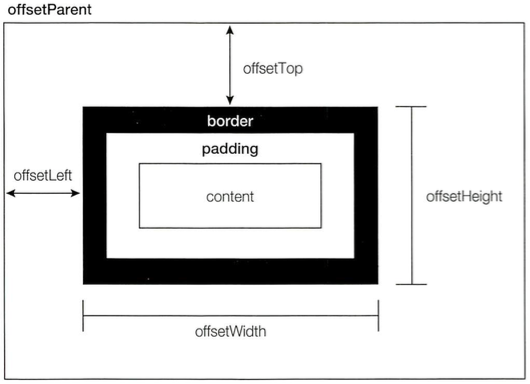
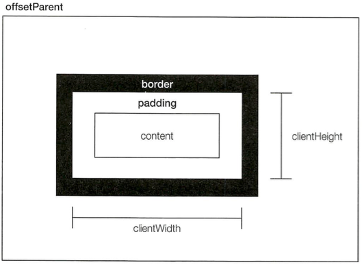
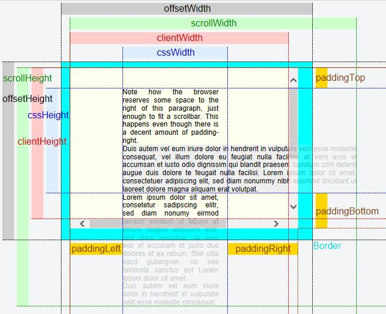
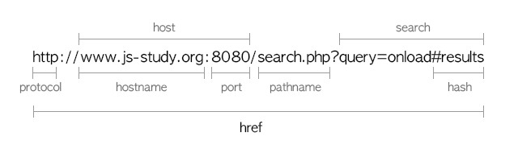

Javascript Study Step03
=====

## BOM(Browser Object Model)

BOM의 주요임무는 브라우저창을 관리하는 것이며, 웹에서 사용하는 자바스크립트의 핵심입니다.

### window 객체

* Javacript 동작에 필요한 전역 객체로 동작합니다.
* HTML 문서로 향하는 관문으로서 document 객체를 갖고 있습니다.
* 다양한 정보와 동작을 담고 있습니다.

### 전역 스코프

window 객체가 ECMAScript 의 Global 객체 구실을 하므로 전역에서 선언한 변수와 함수는 모두 Window 객체의 프로퍼티 및 메서드가 됩니다.

```js
var color = 'red';

function sayColor() {
    console.log(this.color);
}

console.log(window.color);
sayColor();
window.sayColor();
```

### window 프로퍼티

| 프로퍼티        | 기능               |
| ----------- | ---------------- |
| closed      | 창이 닫혀있는지 참조      |
| opener      | 자기 자신을 오픈한 창을 참조 |
| innerWidth  | 창의 안쪽 넓이         |
| innerHeight | 창의 안쪽 높이         |
| outerWidth  | 창의 바깥쪽 넓이        |
| outerHeight | 창의 바깥쪽 높이        |
| name        | 창 이름 참조 및 설정     |

### 창 크기 구하기

```js
// 스크롤 바를 포함한 브라우저의 가로 뷰포트의 폭 (IE9+)
var nViewportWidth = window.innerWidth;
```

* DOM을 통해 요소의 정보를 알아봅니다.

```js
var elContent = document.getElementById('content');
```

#### 오프셋 크기



요소가 화면에서 차지하는 영역 전체크기를 나타냅니다.
컨텐츠 크기에 패딩, 스크롤바, 보더값을 합친 크기이며, 마진은 포함되지 않습니다.

* offsetHeight : 컨텐츠 높이 + 상하단 패딩 + 가로 스크롤바 + 상하단 보더
* offsetWidth : 컨텐츠 너비 + 좌우 패딩 + 세로 스크롤바 + 좌우 보더
* offsetLeft - 컨테이너 왼편과 요소사이 거리
* offsetTop - 컨테이너 상단과 요소사이 거리

#### 클라이언트 크기



요소가 차지하는 공간, 스크롤바는 포함되지 않습니다.
각 요소에서 clientWidth, clientHeight 프로퍼티로 너비와 높이를 알 수 있습니다. 이 프로퍼티는 브라우저 뷰포트(viewport)를 알아낼 때 많이 쓰입니다.

* 기능탐지

```js
// window창 안쪽 크기 (IE9+)
window.innerWidth;
window.innerHeight;

// <html> 요소의 크기
document.documentElement.clientWidth;
document.documentElement.clientHeight;

// <body> 요소의 크기 (IE6, quirks mode)
document.body.clientWidth;
document.body.clientHeight;

// viewport 구하기 예시
function getViewportHeight() {
    var pageHeight = window.innerHeight;
    
    if(typeof pageHeight != 'number') {
        // BackCompat : quirks Mode
        // CSS1Compat : standard
        if (document.compatMode == 'CSS1Compat') {
            pageHeight = document.documentElement.clientHeight;
        } else {
            pageHeight = document.body.clientHeight;
        }
    }
    
    return pageHeight;
}

function getViewportHeight () {
    return window.innerHeight || document.documentElement.clientHeight;
}

function getViewportWidth () {
    return document.documentElement.clientWidth;
}
```

> `<body>` 태그를 어떻게 해석하는가의 차이, 오래전에는 `<body>` 요소가 눈에 보이는 가장 최상위 요소였습니다. 그리고 `<html>` 요소는 숨겨진 채로 남아 있었습니다. 최신 브라우저에서 `<body>`는 일반 블록 레벨 요소고, `<html>` 이 전체 브라우저창을 의미하도록 변경되었습니다.
>
> 기능탐지 -> 쿽스탐지 -> 브라우저탐지(UA)

#### 스크롤 크기

* scrollHeight : 컨텐츠의 실제 높이
* scrollWidth: 컨텐츠의 실제 너비
* scrollLeft: 요소가 왼쪽에서 스크롤된 거리, 값을 설정하면 새 위치로 스크롤 한다.
* scrollTop: 요소가 상단에서 스크롤된 거리, 값을 설정하면 새 위치로 스크롤 한다.

> 문서 전체의 높이 `document.documentElement.scrollHeight`



#### window 메서드

| 메서드             | 기능                       |
| --------------- | ------------------------ |
| open()          | 새 창 열기                   |
| close()         | 창 닫기                     |
| alert()         | 경고 대화상자 표시               |
| confirm()       | 확인 대화상자 표시               |
| prompt()        | 문자 입력 대화상정 표시            |
| setTimeout()    | 일정 시간 후 한 번만 처리하는 타이머 설정 |
| clearTimeout()  | setTimeout() 타이머 해제      |
| setInterval()   | 일정 시간마다 반복처리 하는 타이머 설정   |
| clearInterval() | setInterval()의 타이머 해제    |

##### 인터벌과 타임아웃

인터벌 설정, 해제

```js
// 설정
var intervalId = setInterval(function, delay);

// 해제
clearInterval(intervalId);
```

```js
var num = 0,
    max = 10,
    intervalId = null;
    
function incrementNumber() {
    num++;
    console.log(num);
    // 최댓값에 도달하면 인터벌 해제
    if(num === max) {
        clearInterval(intervalId);
        console.log('Work done');
    }
}

intervalId = setInterval(incrementNumber, 500);
```

타임아웃 설정, 해제

```js
// 설정
var timeoutId = setTimeout(function, delay);

// 해제
clearTimeout(timeoutId);
```

```js
var num = 0,
    max = 10;
    
function incrementNumber() {
    num++;
    console.log(num);
    // 최댓값 보다 작으면 다시 타임아웃 설정
    if(num < max) {
        setTimeout(incrementNumber, 500);
    } else {
        console.log('Work done');
    }
}

setTimeout(incrementNumber, 500);
```

### location 객체

location 객체는 현재 창에 불러온 문서의 URL 정보와 일반적인 네비게이션 기능을 제공합니다.

| 프로퍼티 이름  | 예제                    | 설명             |
| -------- | --------------------- | -------------- |
| href     | URL                   | 현재페이지의 완전한 URL |
| host     | www.js-study.org:8080 | 서버이름과 포트번호     |
| hostname | www.js-study.org      | 포트번호를 제외한 서버이름 |
| hash     | \#result              | 해시             |
| pathname | /search.php           | 디렉토리 및 파일 이름   |
| port     | 8080                  | 포트             |
| protocol | http:                 | 프로토콜           |
| search   | ?query=onload         | 쿼리스트링          |



활용예제 

```js
function getQueryStringArgs() {
    // 물음표 뒤의 쿼리스트링을 가져옵니다.
    var qs = location.search.length > 0
        ? location.search.substring(1)
        : '';
        
    // 데이터를 저장할 객체
    var args = {},
        // 각각의 매개변수
        items = qs.length ? qs.split('&') : [],
        item = null,
        name = null,
        value = null;
        
    // 각 매개변수를 args 객체에 할당
    for (var i = 0, len = items.length; i < len; i++) {
        item = items[i].split('=');
        name = decodeURIComponent(item[0]);
        value = decodeURIComponent(item[1]);
        
        if(name.length) {
            args[name] = value;
        }
    }
    
    return args;
}

var args = getQueryStringArgs();
```

#### location 조작

location 객체를 조작해서 페이지를 이동할 수 있습니다.

* location.assign();

```js
// 새 URL로 이동하며 브라우저의 히스토리 스택에 기록이 추가됩니다.
location.assign('http://www.js-study.org');
```

`location.href` 나 `window.location` 에 URL을 설정하면 자동으로 그 값으로 `assign()` 메서드를 호출합니다.

보통 `location.href` 에 값을 설정하는 방법을 많이 사용합니다.

```js
location.href = 'http://www.js-study.org');
window.location = 'http://www.js-study.org');
```

* location.replace();

```js
// 새 URL로 이동하지만 브라우저 히스토리 스택에 기록을 남기지 않습니다.
location.replace('http://www.jq-study.org');
```

* location.reload();

```js
location.reload();		// 가능하면 캐쉬에서
location.reload(true);	// 항상 서버에서
```

### history 객체

| 프로퍼티   | 기능    | 예제                        |
| ------ | ----- | ------------------------- |
| length | 이력 개수 | `if(history.length == 0)` |

| 메서드       | 기능           | 예제                   |
| --------- | ------------ | -------------------- |
| back()    | 한 페이지 뒤로 이동  | `history.back();`    |
| forward() | 한 페이지 앞으로 이동 | `history.forward();` |
| go()      | 지정한 값 만큼 이동  | `history.go(2);`     |

### navigator 객체

| 프로퍼티 / 메서드    | 기능                            |
| ------------- | ----------------------------- |
| appName       | 브라우저 이름                       |
| appVersion    | 브라우저의 버전                      |
| appCodeName   | 브라우저의 코드명                     |
| platform      | OS 기종                         |
| userAgent     | 브라우저 문자열(브라우저의 종류나 버전에 대한 정보) |
| javaEnabled() | 브라우저에 자바가 활성화 되어있는지 여부        |

1. 기능탐지
2. 쿽스탐지(버그탐지)
3. 브라우저 탐지(userAgent)

### screen 객체

| 프로퍼티        | 기능                |
| ----------- | ----------------- |
| availHeight | 작업표시줄을 제외한 화면의 높이 |
| availWidth  | 작업표시줄을 제외한 화면의 너비 |
| colorDepth  | 사용 가능한 색상 수       |
| height      | 화면의 높이            |
| width       | 화면의 너비            |
| pixelDepth  | 화면 픽셀당 비트숫자       |