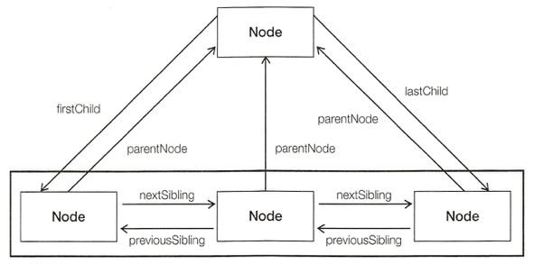

Javascript Study Step04
=====

## DOM

문서객체모델(DOM)은 HTML 문서에 대한 애플리케이션 프로그래밍 인터페이스(API) 입니다.

* DOM은 문서를 노드의 계층 구조 트리로 표현하며,
* Javascript로 문서의 모든 노드에 접근할 수 있고,
* 요소의 상태를 알 수 있는 메소드와 프로퍼티, 
* 요소를 추가하고 제거, 이동할 수 있는 메소드를 제공합니다.

### 노드

HTML 문서 안의 모든 것은 노드입니다. 즉 문서는 노드의 집합입니다.

* 문서 노드 - 문서의 각 노드에 최상단에 위치한다.
* 요소 노드 - HTML 요소를 나타낸다. 문서의 구조
* 속성 노드 - 요소노드의 속성, 요소의 정보
* 텍스트 노드 - 요소노드의 텍스트, 문서의 내용

### 노드 계층

```html
<!DOCTYPE html>
<html>
<head>
    <title>Sample Page</title>
</head>
<body>
    <p>Hello Wordl!</p>
</body>
</html>
```

**Document**

* **Element** html
    - **Element** head
        - **Element** title
            - **Text** Sample Page
    - **Element** body
        - **Element** p
            - **Text** Hello World!

### DOM 요소 찾기

* getElementById()
* getElementsByTagName()

```js
// id 값으로 요소 구하기
var element = document.getElementById(id);

var someEl = document.getElementById('someId');
someEl.className = 'someClass';

// 태그명으로 요소 구하기
var elements = document.getElementsByTagName(tagname);

var paras = document.getElementsByTagName('p'),
    fifthP = paras[4];
```

```js
var targetList = document.getElementById('targetId'),
    items = targetList.getElementsByTagName('li');
```

* getElementsByClassName()
* querySelector()
* querySelectorAll()

```js
// class 명으로 요소구하기, IE9+
var elements = document.getElementsByClassName('someClassName');

// css 선택자에 일치하는 것 중 첫 번째 요소, IE8+(IE8, CSS 2.1)
var element = document.querySelector('li.item');

// css 선택자에 일치하는 모든 요소, IE8+(IE8+, CSS 2.1)
var elements = document.querySelectorAll('li.item');
```

### DOM 정보

* nodeType

nodeType은 노드의 타입을 나타내는 숫자를 담고 있다.

| Node 타입                     | nodeType |
| ----------------------------- | -------- |
| **Node.ELEMENT_NODE** (요소)  | **1**    |
| Node.ATTRIBUTE_NODE (속성)    | 2        |
| **Node.TEXT_NODE** (텍스트)   | **3**    |
| Node.COMMENT_NODE (주석)      | 8        |
| Node.DOCUMENT_NODE (도큐먼트) | 9        |

```js
if(someNode.nodeType === 1) {
    console.log('Node is an Element');
}
```

* nodeName

노드의 이름을 담고있다.

```js
elementNode.nodeName                // 태그 이름
textNode.nodeName                   // #text
attribute.nodeName                  // 속성 이름
documentNode.nodeName               // #document
```

```js
if(evtTarget.nodeName == 'SELECT' && e.type == 'change') {
	statements;
}
```

* nodeValue

```js
elementNode.nodeValue               // null
textNode.nodeValue                  // 실제 텍스트
attribute.nodeValue                 // 속성 값
documentValue.nodeName              // null
```

* className

```js
var className = elementNode.className;

elementNode.className = cName;
```

### DOM 탐색



* parentNode()
* firstChild()
* lastChild()
* previousSibling()
* nextSibling()

* childNodes

### DOM 조작

* appendChild()

`childNodes` 목록에 노드를 추가합니다.

```js
var returnedNode = parentNode.appendChild(newNode);
console.log(returnedNode == newNode);               // true
console.log(parentNode.lastChild == newNode);       // true
```

`appendChild()`에 넘긴 노드가 이미 문서에 존재하고 있었다면 해당 노드는 이전의 위치를 벗어나 새 위치로 이동합니다.

```js
var returnedNode = parentNode.appendChild(parentNode.firstChild);
console.log(returnedNode == someNode.firstChild);   // false;
console.log(returnedNode == someNode.lastChild);    // true;
```

* insertBefore()

한 노드를 특정한 위치로 옮겨야 할 때 사용

```js
var insertedNode = parentNode.insertBefore(newNode, referenceNode);
```

```js
// 마지막 자식으로 삽입
var returnedNode = parentNode.insertBefore(newNode, null);
console.log(newNode == parentNode.lastChild);       // true

// 첫 자식으로 삽입
var returnedNode = parentNode.insertBefore(newNode, parentNode.firstChild);
console.log(returnedNode == newNode);               // true
console.log(newNode == parentNode.firstChild);      // true

// 마지막 자식 앞에 삽입
var returnedNode = parentNode.insertBefore(newNode, someNode.lastChild);
console.log(newNode == parentNode.childNodes[parentNode.childNodes.length-2]);  // true
```

* replaceChild()

기존 노드를 교체

```js
// 첫 번째 자식을 교체
var returnedNode = parentNode.replaceChild(newNode, someNode.firstChild);

// 마지막 자식을 교체
var returnedNode = someNode.replaceChild(newNode, someNode.lastChild);
```

* removeChild()

노드를 제거할 때 사용합니다.

```js
// 첫 번째 자식을 제거
var formerFirstChild = parentNode.removeChild(parentNode.firstChild);

// 마지막 자식을 제거
var formerLastChild = parentNode.removeChild(parentNode.lastChild);
```

* cloneNode()

노드를 복제한다.

```js
var dupNode = node.cloneNode(deep);
```

```js
var subHeading = document.getElementByTagName('h2')[0],
    tempNode = subHeading.clone(true);

document.body.appendChild(tempNode);
```

`cloneNode()`의 인수 값이  `true` 이면 요소와 그 자식 노드를 모두 복제하고 `false` 는 자식요소를 제외하고 복제한다.

`cloneNode()`는 이벤트 핸들로를 복제하지 않는다.

* createElement()
* createTextNode()

요소와 텍스트를 생성하여 문서에 추가할 수 있다.

```js
var element = document.createElement(tagName);

var elPara = document.createElement('p'),
    textNode = document.createTextNode('Some Text');

elPara.appendChild(textNode);
document.body.appendChild(elPara);
```

* innerHTML

MS에서 만든 비표준 프로퍼티

```html
<p id="target">This is a <strong>bold</strong> text.</p>
```

```js
var elTarget = document.getElementById('target');
console.log(elTarget);
// <p id="target">This is a <strong>bold</strong> text.</p>

elTarget.innerHTML = '<p id="target">This is a <em>empahsized</em> text.</p>';
```

### 속성 다루기

* getAttribute()

요소에 접근해서 각 속성 값을 알아낸다.

```html
<div id="myDiv" class="bd" title="Body text" /></div>
```

```js
var attribute = element.getAttribute(attributeName);

var div = document.getElementById('myDiv');
console.log(div.getAttribute('id'));            // 'myDiv'
console.log(div.getAttribute('class'));         // 'bd'
console.log(div.getAttribute('title'));         // 'Body text'
```

속성이 존재하지 않으면 `getAttribute()` 는 `null` 을 반환한다.

* setAttribute()

요소의 속성 값을 변경한다.

```js
element.setAttribute(name, value);

var div = document.getElementById('myDiv');
console.log(div.setAttribute('id', 'otherId'));
console.log(div.setAttribute('class', 'otherClass'));
console.log(div.setAttribute('title', 'Other Text'));
```